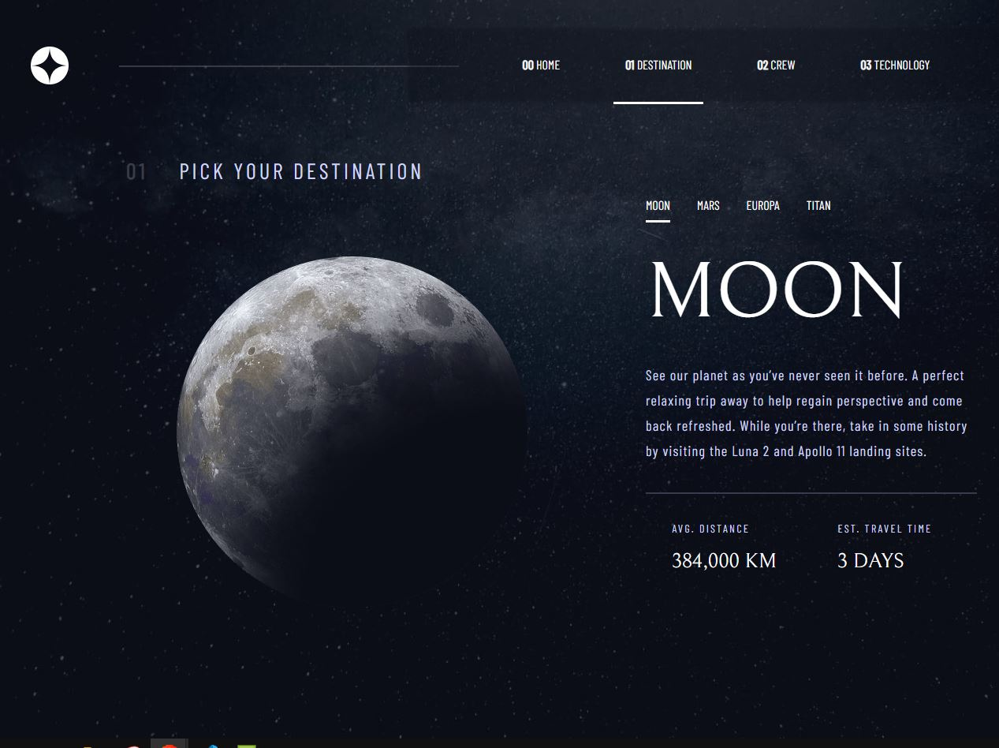
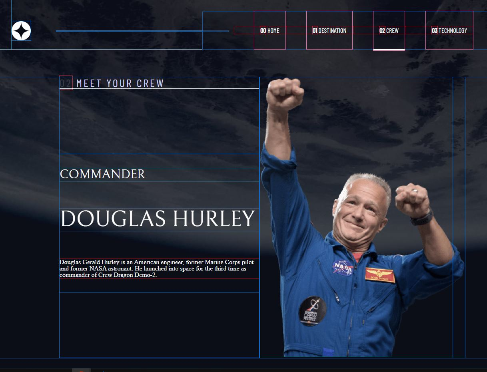

# Frontend Mentor - Space tourism website solution

This is a solution to the [Space tourism website challenge on Frontend Mentor](https://www.frontendmentor.io/challenges/space-tourism-multipage-website-gRWj1URZ3). Frontend Mentor challenges help you improve your coding skills by building realistic projects.

## Table of contents

- [Overview](#overview)
  - [The challenge](#the-challenge)
  - [Screenshot](#screenshot)
  - [Links](#links)
- [My process](#my-process)
  - [Built with](#built-with)
  - [What I learned](#what-i-learned)
  - [Continued development](#continued-development)
  - [Useful resources](#useful-resources)
- [Author](#author)
- [Acknowledgments](#acknowledgments)

## Overview

### The challenge

Users should be able to:

- View the optimal layout for each of the website's pages depending on their device's screen size
- See hover states for all interactive elements on the page
- View each page and be able to toggle between the tabs to see new information

### Screenshot

Here are some of the pictures of actual website.

##### Desktop - view

##### Tablet - view

##### Mobile - view

### Links

- Live Site URL: [Space Dev Challenge](https://spacedevchallenge.netlify.app/index.html)

## My process

### Built with

- Semantic HTML5 markup
- CSS custom properties
- Flexbox
- Desktop-first workflow

### What I learned

One of the massives aspects after developed this challenge is how it's hard to feel comfortable with CSS, but I loved it. I love how this challenge allowed me to use Figma and was intriguing to find and look for ways to fit everything.

A tool that really helped me was the Pesticide extension, for example below, where you can see the boxes it's wonderful such a tool.

And with some fixes

### Continued development

I'll try this project again when I'll start to study react. I did this challenge with html and css only. So that data.json was useless, for me. I want to use it next time. Also, I aim to use CSS Grid, next time. Now, I'm quite comfortable with flexbox.

### Useful resources

- [A Complete Guide to Flexbox](https://css-tricks.com/snippets/css/a-guide-to-flexbox/) - I can't say enough how this guide helped me. I'm just grateful for the pure existance of this. The properties for the Children (flex items), and how it is visually applicable.

## Author

- Frontend Mentor - [@mpfdev](https://www.frontendmentor.io/profile/mpfdev)
- Twitter - [@mpfdev](https://www.twitter.com/mpfdev)

## Acknowledgments

One of the biggests flex on layouting is to see that everything is a box. This is a great challenge, it's simple on positioning elements, and it's great how it helps you to understand and see through how everything is a box.
